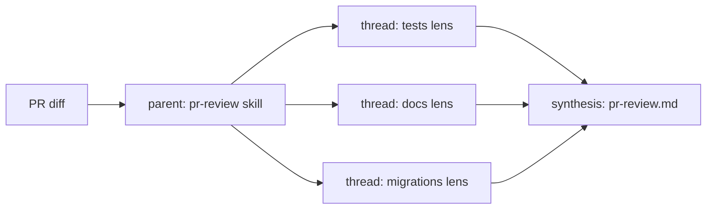

<p align="center">
  
</p>

<h1 align="center">genesis</h1>

<p align="center">
  <strong>Markdown that steers an LLM is code. Design it before you write it.</strong>
</p>

<p align="center">
  <a href="https://agentskills.io"></a>
  <a href="LICENSE"></a>
  <a href="https://github.com/danielmeppiel/genesis/stargazers"></a>
  <a href="https://github.com/danielmeppiel/genesis/commits/main"></a>
</p>

<p align="center">
  <a href="#worked-example">Worked example</a> &middot;
  <a href="#failure-modes">Failure modes</a> &middot;
  <a href="#the-shift">The shift</a> &middot;
  <a href="#install">Install</a> &middot;
  <a href="#primitives">Primitives</a> &middot;
  <a href="#patterns">Patterns</a> &middot;
  <a href="#process">Process</a> &middot;
  <a href="#runtimes">Runtimes</a>
</p>

---

Most agent skills, agents, and instruction files are written like prose for humans. They are not. They are **code for an inferencing engine** with a finite context window, an attention drop-off, and a probabilistic output distribution. Without an architectural discipline they dilute into context bloat, cross-contaminated lenses, and quietly drifting outputs.

`genesis` is the design discipline that comes before authoring. It teaches your agent to think like a software architect first: **name the primitives, choose a pattern, draw the diagram, persist the plan &mdash; then write the file.**

## Worked example

A common ask:

> *"Use the genesis-architect persona and the genesis discipline to design a skill that reviews my PRs before I do &mdash; checking for missing tests, undocumented public API, and unsafe migrations."*

Genesis produces this **before** writing any file:

**GOAL.** One reviewer that flags missing tests, undocumented public API, and unsafe migrations on a PR diff.

**PRIMITIVES.**
- `MODULE ENTRYPOINT` &mdash; the `pr-review` skill itself.
- `CHILD-THREAD SPAWN` &times; 3 &mdash; one per lens (tests, docs, migrations), so each runs in a fresh context window.
- `PLAN PERSISTENCE` &mdash; findings written to `pr-review.md` so a re-run on the same PR is comparable.

**PATTERN.** **P2** (fan-out + parent synthesizer). The three lenses are independent and share no state; running them in one window cross-contaminates voice and dilutes attention. Justified.

**UML.**



**ACCEPTANCE.** On a PR with one missing test, one undocumented export, and a benign migration, the output names exactly two findings (no false positive on the migration), each citing the file path.

**PLAN.** `pr-review.md` written first. Only then does the agent author the skill, the persona, and the rule files.

This output is what the discipline buys you. The file you eventually write is the easy part.

## Failure modes

Symptoms an architect recognises &mdash; even before the vocabulary lands:

- **The agent file that grew teeth.** Your `CLAUDE.md` (or `.cursor/rules`, or `.github/copilot-instructions.md`) was forty lines. It is now four hundred. The agent ignores half of it and you cannot tell which half.
- **Great at turn one, confidently wrong by turn twenty.** The early constraints slid out of attention as the later notes piled up. Re-pasting holds for two turns, then drifts again.
- **The same paragraph in four places.** A convention copy-pasted across a skill, an instruction file, and a slash command. You edited one of them last week. The agent now contradicts itself depending on which one fires.

These are not writing problems. They are architecture problems wearing prose clothing &mdash; a missing type system, a missing process loop, a missing dependency edge.

For a senior version of the same failure &mdash; a five-lens review panel cross-contaminating inside one context window &mdash; see [the worked review-panel example](assets/worked-example-review-panel.md).

## The shift

Authoring agentic primitives is no longer a writing job. It is an architecture job. An LLM is a capable but amnesiac engineer: every turn starts with whatever fits in its context window, and nothing else.

Three roles fall out of that constraint:

- **Architect** &mdash; you design the work before any agent writes a line. You decide which primitives exist, how they compose, and which run in their own threads.
- **Reviewer** &mdash; you verify the output against an acceptance criterion you wrote *before* you saw the result.
- **Escalation handler** &mdash; you absorb the cases the agent cannot, with enough context loaded to be useful.

Genesis is the discipline you apply when you are wearing the architect hat. It gives you a vocabulary, a pattern catalogue, a composition model, and a persisted-plan loop.

## Install

One line via [APM](https://github.com/microsoft/apm):

```bash
apm install danielmeppiel/genesis
```

Or drop the files into your harness's skills folder manually &mdash; see the [runtime adapters](#runtimes) for the right path per harness.

Then invoke as in the worked example above.

---

## Primitives

Every harness implements the same six concepts under different folder names. Genesis names them once so the vocabulary outlives any one tool.

| Concept | What it is | Industry term |
|---|---|---|
| **PERSONA SCOPING FILE** | A document loaded at session start to scope WHO the agent is. | "agent file", "subagent", "mode" |
| **MODULE ENTRYPOINT** | A bundled, self-contained capability with assets and a contract. | "skill" ([agentskills.io](https://agentskills.io)) |
| **SCOPE-ATTACHED RULE FILE** | A constraint that auto-applies to a path or context. | "instruction", "rule", "memory" |
| **CHILD-THREAD SPAWN** | A primitive that creates a new context window running in parallel. | "subagent thread", "Task tool" |
| **TRIGGER ORCHESTRATOR** | A declarative pipeline that runs primitives on events. | "workflow", "hook", "automation" |
| **PLAN PERSISTENCE** | A stable artifact (file or DB) holding the active plan across turns. | "plan.md", "TODO state", "checkpoints" |

These names are deliberately generic. The discipline must outlive any one tool.

A composition layer sits on top &mdash; how primitives depend on each other, version, and stay portable. See [`assets/composition-substrate.md`](assets/composition-substrate.md).

## Patterns

Eight reusable topologies the architect picks from. P8 is orthogonal to the rest &mdash; combine it with whichever topology fits.

| # | Name | When |
|---|---|---|
| **P1** | Single-loop sequential | One lens, one procedure |
| **P2** | Fan-out + parent synthesizer | >= 3 independent lenses, no shared state |
| **P3** | Conditional dispatch | Single lens, procedure depends on input class |
| **P4** | Validation gate | Output verifiable before it proceeds |
| **P5** | Supervisor / worker | Long task, dynamic plan, bounded delegation |
| **P6** | Orchestrator + persisted artifact | Work spans multiple trigger events |
| **P7** | Composed module (depend, don't duplicate) | A primitive you need already exists |
| **P8** | Plan-first with persisted plan | *Orthogonal:* combine whenever attention decay risks the work |

Full catalogue with mermaid sketches, interlock requirements, anti-patterns, and a selection heuristic: [`assets/design-patterns.md`](assets/design-patterns.md).

P1-P9 are atomic. Recurring *compositions* of them &mdash; PANEL, STAFFED PLAN, WAVE EXECUTION, PLAN/TASKS/IMPLEMENT PIPELINE, RUBBER-DUCK ACCEPTANCE &mdash; live in [`assets/architectural-patterns.md`](assets/architectural-patterns.md). They are the AI-native equivalent of architectural patterns (MVC, CQRS) over class-level patterns.

## Process

The architect's loop. Eight steps; the persisted plan is non-negotiable.

```
1.  STATE GOAL          --> one sentence, observable outcome
2.  NAME PRIMITIVES     --> which concepts will you use?
3.  PICK PATTERN        --> P1..P8, justify in one line
3.5 COMPOSE OR BUILD?   --> can an existing module satisfy this?
4.  DRAW UML            --> mermaid, validate it renders
5.  ACCEPTANCE          --> what proves it works?
6.  PERSIST PLAN        --> write plan.md (or equivalent) BEFORE coding
7.  IMPLEMENT           --> author files; commit
7b. RELOAD PLAN         --> on every meaningful turn, re-read the plan
8.  STOP CONDITION      --> ship, or stop the design
```

Steps 6 and 7b cure the amnesia. Without the reload, the persistence is dead weight; without the persistence, the reload has nowhere to ground.

## Runtimes

| Harness | Persona file format | Skill folder | Adapter |
|---|---|---|---|
| **Claude Code** | `.claude/agents/*.md` (subagents) | `.claude/skills/` | [adapter](assets/runtime-affordances/per-harness/claude-code.md) |
| **GitHub Copilot CLI** | `.github/agents/*.agent.md` | `.github/skills/` | [adapter](assets/runtime-affordances/per-harness/copilot.md) |
| **Cursor** | `.cursor/rules/*.mdc` | `.cursor/skills/` | [adapter](assets/runtime-affordances/per-harness/cursor.md) |
| **OpenCode** | `.opencode/agent/*.md` | `.opencode/skills/` | [adapter](assets/runtime-affordances/per-harness/opencode.md) |
| **Codex** | `AGENTS.md` files | `~/.codex/skills/` | [adapter](assets/runtime-affordances/per-harness/codex.md) |

The primitives are the same. Only the file names change.

## Further reading

`genesis` is the executable companion to *[The Agentic SDLC Handbook](https://github.com/danielmeppiel/agentic-sdlc-handbook)* &mdash; specifically:

- [ch 8: The Practitioner's Mindset](https://github.com/danielmeppiel/agentic-sdlc-handbook/blob/main/handbook/ch08-the-practitioners-mindset.qmd) &mdash; the role-shift to architect / reviewer / escalation handler.
- [ch 10: The PROSE Specification](https://github.com/danielmeppiel/agentic-sdlc-handbook/blob/main/handbook/ch10-the-prose-specification.qmd) &mdash; the constraint language each primitive maps to.
- [ch 11: Context Engineering](https://github.com/danielmeppiel/agentic-sdlc-handbook/blob/main/handbook/ch11-context-engineering.qmd) &mdash; why MODULE ENTRYPOINT, CHILD-THREAD SPAWN, and PLAN PERSISTENCE exist.
- [ch 12: Multi-Agent Orchestration](https://github.com/danielmeppiel/agentic-sdlc-handbook/blob/main/handbook/ch12-multi-agent-orchestration.qmd) &mdash; the theory the eight patterns implement.

Each primitive earns its place against [PROSE](https://danielmeppiel.github.io/awesome-ai-native/): lazy assets in MODULE ENTRYPOINT are *Progressive Disclosure*; CHILD-THREAD SPAWN is *Reduced Scope*; pattern P7 is *Orchestrated Composition*; P4 is *Safety Boundaries*; cascading SCOPE-ATTACHED RULE FILEs are *Explicit Hierarchy*.

## License

MIT. If this changes how you design agent primitives, I want to hear about it &mdash; find me on [GitHub](https://github.com/danielmeppiel) or [LinkedIn](https://www.linkedin.com/in/danielmeppiel/).

<sub>By Daniel Meppiel &mdash; author of <a href="https://github.com/danielmeppiel/agentic-sdlc-handbook"><em>The Agentic SDLC Handbook</em></a>.</sub>

---

<p align="center">
  <em>"Architect first. Then write the skill."</em>
</p>
