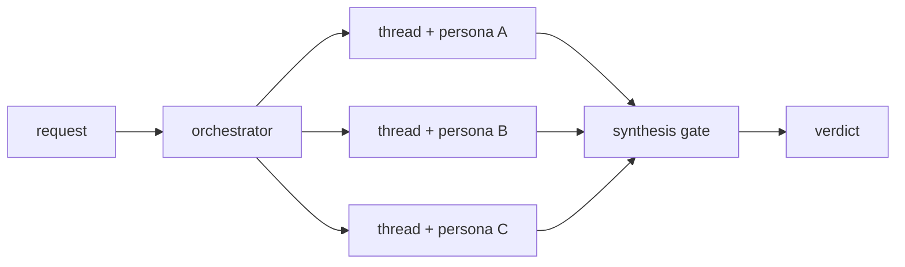
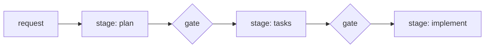
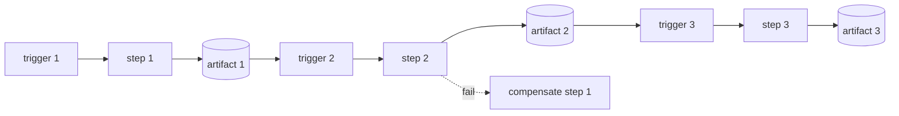
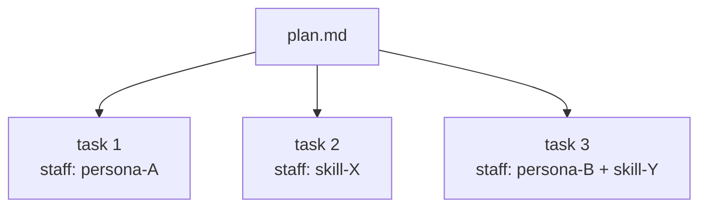
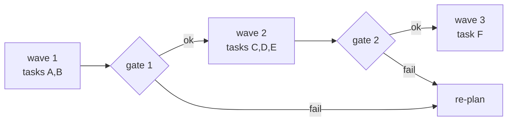
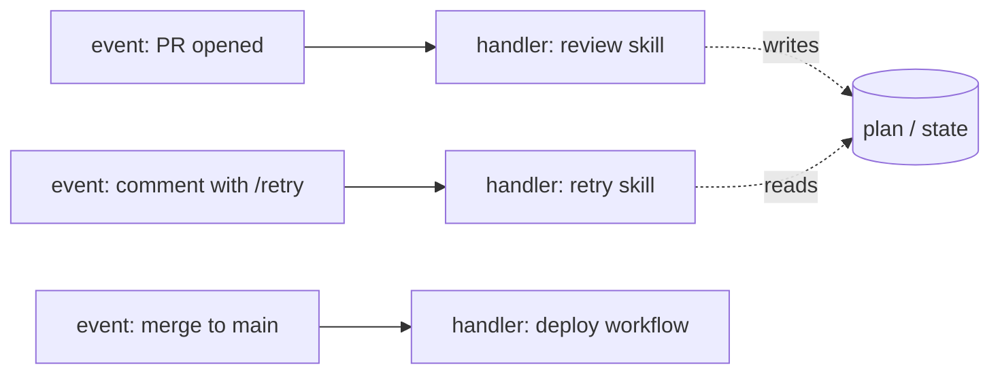
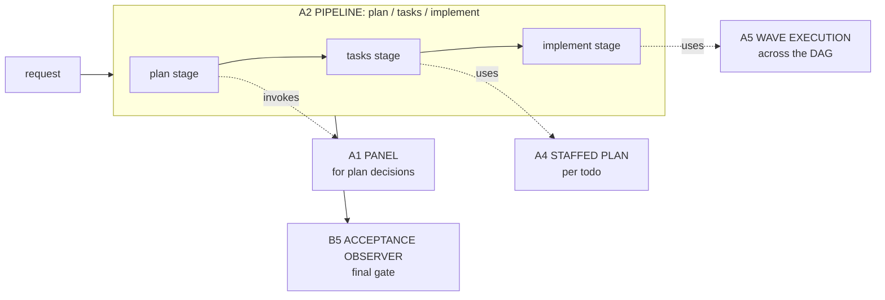

# TIER 3 -- Architectural patterns (system topology)

A Tier-3 pattern names the SYSTEM SHAPE of a non-trivial agentic
capability. Each composes several Tier-2 design patterns plus
substrate primitives. They are the AI-native equivalents of classical
architectural patterns (Layered, Pipes-and-Filters, Microservices,
Saga, Event-Driven) -- the macro shapes a Tier-2 pattern alone cannot
express.

When you recognize a Tier-3 shape, name it and inherit its anti-
patterns verbatim. Re-deriving it from raw Tier-2 patterns risks
rediscovering its failure modes the hard way.

---

## Catalogue at a glance

| AI-native name        | Classical analog            | Composes                                     |
|-----------------------|-----------------------------|----------------------------------------------|
| PANEL                 | Microservices + Gateway     | B1 + N x C2 + S4                             |
| PIPELINE              | Pipes-and-Filters           | B2 per stage + B4 + S4 between stages        |
| ORCHESTRATOR-SAGA     | Saga                        | S3 + B4 + S4 gates                           |
| STAFFED PLAN          | Workflow Engine             | B4 + B7 + B2 per todo + C4                   |
| WAVE EXECUTION        | Build Pipeline (CI stages)  | PIPELINE + B3 per wave + S4 between waves    |
| EVENT-DRIVEN          | Event-Driven Architecture   | TRIGGER ORCHESTRATOR + any Tier-2 mix        |

---

## A1. PANEL (multi-lens deliberation)

CLASSICAL ANALOG: Microservices + API Gateway -- N specialized services
behind one entry point that synthesizes their outputs.

COMPOSES:
- B1 FAN-OUT + SYNTHESIZER (the topology)
- N x C2 PERSONA PRELOAD (one specialized lens per worker)
- S4 VALIDATION DECORATOR at the synthesis step (gates the verdict)
- B4 PLAN MEMENTO (the synthesis output is the plan artifact)

WHEN:
- A decision benefits from >=3 specialized lenses (security, cost,
  UX, architecture, etc.).
- The lenses are independent; no shared state during evaluation.
- The synthesis is itself a decision, not a concatenation.



REAL EXAMPLE: the `apm-review-panel` skill in `microsoft/apm`. See
`worked-example-review-panel.md` for the senior-engineer cautionary
tale of getting this shape wrong.

ANTI-PATTERNS:
- PANEL-WITHOUT-SYNTHESIS -- N lenses, then a concatenation. The user
  reads N reports instead of one decision. The synthesis IS the panel.
- PANEL-IN-ONE-CONTEXT -- running all N lenses sequentially in a
  single window. Each lens contaminates the next; later lenses inherit
  attention drift from earlier ones. The dominant failure mode for
  senior engineers stepping into agent design.
- IMBALANCED PANEL -- N-1 lenses agree, 1 dissents, the synthesis
  follows the majority without examining the dissent. The dissenting
  lens is usually the highest-information signal.

---

## A2. PIPELINE (Pipes-and-Filters)

CLASSICAL ANALOG: Pipes-and-Filters. A linear sequence of independent
filters, each transforming an input into an output for the next.

COMPOSES:
- B2 CONDITIONAL DISPATCH per stage (each stage may pick its
  procedure based on the prior stage's output class)
- B4 PLAN MEMENTO (each stage's output is persisted; the next stage
  reads from the artifact, not from in-context recall)
- S4 VALIDATION DECORATOR between stages (a stage's output is gated
  before the next stage consumes it)

WHEN:
- The work decomposes into ordered stages with verifiable hand-offs.
- Each stage has a different mental mode; mixing them produces noise.
- The PLAN / TASKS / IMPLEMENT decomposition is the canonical case.



ANTI-PATTERNS:
- STAGE COLLAPSE -- "I will plan as I go". Planning and implementation
  in the same turn. The plan ends up post-hoc and un-falsifiable.
- INFINITE PLANNING -- a plan stage that never gates into tasks.
  `plan.md` grows; tasks never atomize; nothing ships.
- TASKS WITHOUT PLAN -- skipping the plan stage; atomizing directly
  from the request. The dependency graph is wrong; the critical path
  is invisible.

---

## A3. ORCHESTRATOR-SAGA

CLASSICAL ANALOG: Saga -- a long-lived multi-step transaction whose
steps are individually committed and individually compensable, with
an orchestrator coordinating the sequence.

COMPOSES:
- S3 ORCHESTRATOR FACADE (one entrypoint hides the multi-step
  topology from the dispatcher)
- B4 PLAN MEMENTO (every step's outcome is persisted so the saga
  can resume across spawns / sessions / failures)
- S4 VALIDATION DECORATOR at each step (a step that fails triggers
  compensation, not propagation)
- TRIGGER ORCHESTRATOR (substrate) for cross-session continuation

WHEN:
- Work spans more than one trigger event (PR opened, then comment,
  then merge, etc.).
- Steps must be individually durable; partial completion is meaningful
  state.
- Failure at step N requires compensation of steps 1..N-1, not a
  rerun from scratch.



ANTI-PATTERNS:
- ANEMIC SAGA -- a saga whose steps have no compensation logic. On
  partial failure, the system is in an undefined state.
- IMPLICIT TRIGGER COUPLING -- assuming a future trigger will fire
  "soon enough". Without TRIGGER ORCHESTRATOR pinning the cadence,
  the saga stalls invisibly.

---

## A4. STAFFED PLAN

CLASSICAL ANALOG: Workflow Engine with role-bound tasks (a workflow
where each task names the role / capability that must execute it,
and the engine routes to the matching worker).

COMPOSES:
- B4 PLAN MEMENTO (the plan is durable)
- B7 TODO COMMAND (each task is a serialized command with a `staff`
  field naming the persona / skill)
- B2 CONDITIONAL DISPATCH per todo (the executor matches the
  staffing field to a loaded persona / skill)
- C4 DESCRIPTION DISPATCH when a todo's `staff` field names a skill
  the dispatcher must locate

WHEN:
- The plan has tasks that benefit from different lenses or skills
  (one task needs security review, another needs schema design,
  etc.).
- Each task is large enough that loading a specialized persona /
  skill pays for itself in output quality.



COMPOUNDING GAIN: a task with `staff: skill-X` realizes itself as
a CHILD-THREAD SPAWN that loads skill-X in a fresh context window.
Each task becomes both individually-staffed AND individually-isolated.

ANTI-PATTERNS:
- GOD-PERSONA -- one persona for every task. Defeats specialization;
  every task pays the same lens-loading cost regardless of fit.
- INLINE-PERSONA -- pasting persona content into the plan body
  instead of referencing it. The plan becomes a god module. Use the
  link; let the dispatcher load.

---

## A5. WAVE EXECUTION

CLASSICAL ANALOG: Build Pipeline with stages and gates (CI/CD).

COMPOSES:
- A2 PIPELINE (the spine)
- B3 SUPERVISOR per wave (decides what to spawn next within the wave)
- S4 VALIDATION DECORATOR between waves (a gate that determines
  whether the next wave's assumptions hold)
- B7 TODO COMMAND grouped by wave depth in the DAG

WHEN:
- The plan has a non-trivial task DAG.
- Tasks within a wave are independent; waves have ordering.
- Drift between waves is plausible enough that catching it late is
  expensive.

PROCEDURE:
1. Topologically sort the task DAG.
2. Group tasks at the same depth into a wave.
3. After each wave, run the gate: do the wave's outputs satisfy the
   assumptions the next wave depends on?
4. On gate failure, RE-PLAN FROM THE FAILED WAVE, not from the start.



ANTI-PATTERNS:
- WAVE-WITHOUT-GATE -- topologically sorting tasks but not gating
  between waves. Drift compounds silently; failure surfaces at the
  end with no localizable cause.
- EVERY-TASK-IS-A-WAVE -- each task gets its own gate. Gates
  degenerate to noise; the supervisor pays orchestration cost for
  no parallelism win. Combine independent tasks into one wave.

---

## A6. EVENT-DRIVEN

CLASSICAL ANALOG: Event-Driven Architecture -- producers emit events;
handlers react asynchronously; loose coupling between them.

COMPOSES:
- TRIGGER ORCHESTRATOR (substrate) as the event surface
- Any Tier-2 mix as the handler body
- B4 PLAN MEMENTO when a handler must coordinate with another
  handler that fires later

WHEN:
- Work is reactive: PR opened -> review starts; comment with label
  -> follow-up runs; merge -> deploy fires.
- Handlers are loosely coupled; no handler knows the others by name.
- Cadence is event-driven, not time-driven.



ANTI-PATTERNS:
- IMPLICIT EVENT CHAINS -- a handler that assumes another handler
  fired first. Make the dependency explicit via a persisted artifact
  the second handler reads.
- EVENT FAN-OUT WITHOUT BUDGET -- one event triggering N handlers
  with no rate limit. Budget your concurrency.

---

## How Tier-3 patterns compose with each other

Tier-3 patterns are not mutually exclusive. The canonical senior-
engineer plan combines several:



A2 PIPELINE shapes the macro stages. A4 STAFFED PLAN fills task slots
in the tasks stage. A5 WAVE EXECUTION runs the implement stage when
the DAG warrants it. B5 ACCEPTANCE OBSERVER (a Tier-2 behavioral
pattern) closes the work. A1 PANEL plugs into any stage that needs
deliberation rather than single-lens judgement.

---

## Selection heuristic

```
need >=3 specialized lenses with a synthesis decision?
  -> A1 PANEL

work decomposes into ordered stages with verifiable hand-offs?
  -> A2 PIPELINE

work spans multiple trigger events; partial completion meaningful?
  -> A3 ORCHESTRATOR-SAGA

plan exists; tasks benefit from per-task staffing?
  -> A4 STAFFED PLAN

task DAG is non-trivial; drift between waves is expensive?
  -> A5 WAVE EXECUTION

work is reactive to events from outside the agent?
  -> A6 EVENT-DRIVEN
```

When two patterns fit, prefer the one that gives each thread a
narrower context (fewer competing tokens).
