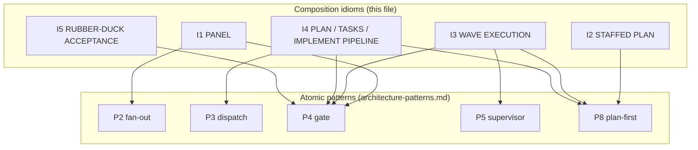
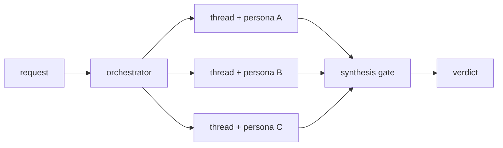
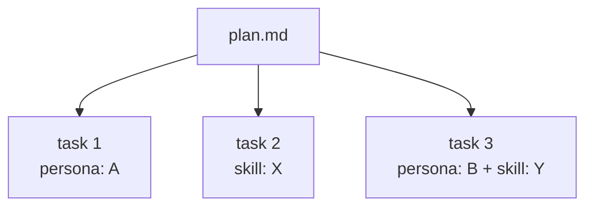
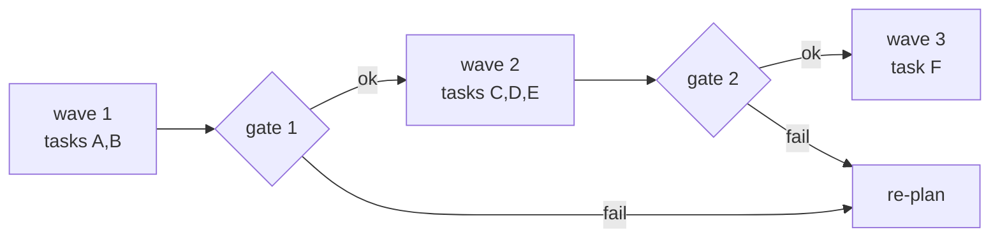
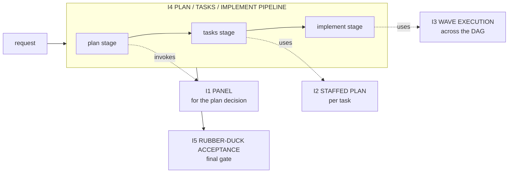

# Composition Idioms (the high-order patterns)

P1-P9 in [`architecture-patterns.md`](architecture-patterns.md) are
atomic: each names a single topology decision or refactor decision.
This file names the COMPOSITIONS over those patterns that recur
often enough to deserve a name &mdash; the AI-native equivalent of
architectural patterns (MVC, CQRS, layered) layered over class-level
patterns (Strategy, Observer, Decorator).

An idiom answers: *given several P-patterns and several primitives,
what is the standard configuration for THIS class of problem?*
Reaching for a named idiom is faster than re-deriving the
P-composition from first principles, and it guards against the
characteristic failure modes that only emerge when the right Ps
combine.

## How idioms relate to patterns



---

## I1. PANEL (multi-lens deliberation)

COMPOSES: P2 fan-out + N specialized `PERSONA SCOPING` files +
P4 validation gate at synthesis.

WHEN:
- A decision benefits from >= 3 specialized lenses (security,
  cost, UX, architecture, etc.).
- The lenses are independent &mdash; no shared state during
  evaluation.
- The synthesis itself is a decision, not a concatenation.

INVOCATION: each lens runs in its own `CHILD-THREAD SPAWN`, loading
its own persona at startup. The parent receives N findings and runs
a synthesis pass that arbitrates conflicts, weights by severity, and
produces ONE verdict.



CLASSIC ANALOGUE: peer review board; multi-paradigm code review;
expert panel.

REAL EXAMPLE: the `apm-review-panel` skill in `microsoft/apm`. See
also [`worked-example-review-panel.md`](worked-example-review-panel.md)
for the senior-engineer version of getting this wrong.

ANTI-PATTERNS:
- **PANEL-WITHOUT-SYNTHESIS**: running N lenses then concatenating
  outputs without arbitration. The user reads N reports instead of
  one decision. The synthesis IS the panel.
- **PANEL-IN-ONE-CONTEXT**: running all N lenses sequentially inside
  a single context window. Each lens contaminates the next; later
  lenses inherit attention drift from earlier ones. This is the
  failure the worked-example-review-panel catalogues, and the most
  common one for senior engineers stepping into agent design.
- **IMBALANCED PANEL**: N - 1 lenses agree, 1 dissents, and the
  synthesis follows the majority without examining the dissent. The
  dissenting lens is usually the highest-information signal.

---

## I2. STAFFED PLAN (per-task persona / skill assignment)

COMPOSES: P8 plan-first + per-todo lookup of `PERSONA SCOPING` or
`MODULE ENTRYPOINT` *by reference, not inline*.

WHEN:
- A plan has tasks that benefit from different lenses or skills
  (one task needs security review, another needs schema design,
  etc.).
- Each task is large enough that loading a specialized persona pays
  for itself in output quality.



CLASSIC ANALOGUE: project staffing; function-pointer table; strategy
pattern at the task level.

ANTI-PATTERNS:
- **GOD-PERSONA**: one persona used for every task in the plan.
  Defeats specialization; every task pays the same lens-loading
  cost regardless of fit.
- **INLINE-PERSONA**: pasting persona content into the plan body
  instead of referencing it. The plan becomes a god module. Use
  the link; let the dispatcher load.

---

## I3. WAVE EXECUTION (DAG with verification checkpoints)

COMPOSES: P8 plan + P5 supervisor / worker + P4 validation gate
BETWEEN waves.

WHEN:
- The plan has a non-trivial task DAG.
- Tasks within a wave are independent; waves have ordering.
- Drift between waves is plausible enough that catching it late is
  expensive.

PROCEDURE:
1. Topologically sort the task DAG.
2. Group tasks at the same depth into a wave.
3. After each wave, run a P4 gate: do the wave's outputs satisfy
   the assumptions the next wave depends on?
4. On gate failure, re-plan FROM the failed wave, not from the
   start.



CLASSIC ANALOGUE: CI/CD stages; CPM critical-path scheduling;
build-pipeline gates.

ANTI-PATTERNS:
- **WAVE-WITHOUT-GATE**: topologically sorting tasks but not gating
  between waves. Drift compounds silently; failure surfaces at the
  end with no localizable cause.
- **EVERY-TASK-IS-A-WAVE**: each task gets its own gate. Gates
  degenerate to noise; the supervisor pays orchestration cost for
  no parallelism win. Combine independent tasks into one wave.

---

## I4. PLAN / TASKS / IMPLEMENT PIPELINE (staged decoupling)

COMPOSES: P3 conditional dispatch (by stage) + P8 plan-first +
P4 gate between stages.

WHEN:
- A request is large and benefits from explicit boundaries between
  (a) defining the goal and approach, (b) atomizing into tasks with
  dependencies, (c) executing.
- Each stage is a different mental mode; mixing them produces
  either premature implementation or infinite planning.


CLASSIC ANALOGUE: compile / link / run; design / decompose / build;
spec / scaffold / fill.

ANTI-PATTERNS:
- **STAGE-COLLAPSE**: "I will plan as I go" &mdash; planning and
  implementation in the same turn. The plan ends up post-hoc and
  un-falsifiable.
- **INFINITE-PLANNING**: a plan stage that never gates into tasks.
  Symptom: `plan.md` grows; tasks never atomize; nothing ships.
  The gate after stage 1 is mandatory.
- **TASKS-WITHOUT-PLAN**: skipping stage 1; atomizing directly from
  the request into todos. The dependency graph is wrong, the
  critical path is invisible, and the staffing decisions in I2 lose
  their grounding.

---

## I5. RUBBER-DUCK ACCEPTANCE (reverse-direction final gate)

COMPOSES: P4 validation gate at the END of the work + the original
`ACCEPTANCE` criterion written in step 5 of the process loop.

WHEN: any non-trivial work. The cost is low (one gate) and the catch
rate is high (drift accumulates silently throughout execution).

PROCEDURE:
1. Reload the `ACCEPTANCE` criterion from the persisted plan.
2. Without re-reading the implementation, list what the criterion
   demands.
3. Now compare against the implementation. Mismatch = drift.

The *rubber duck* framing matters: the gate runs AGAINST the plan,
not against the implementation. Reading the implementation first
biases the gate to approve.

CLASSIC ANALOGUE: integration test; postcondition check;
design-by-contract assertion.

ANTI-PATTERNS:
- **ACCEPTANCE-DRIFT**: silently editing the criterion mid-work to
  match the emerging result. The criterion is now a description,
  not a test. Pin the criterion in the plan; only revise via an
  explicit re-plan event.
- **ACCEPTANCE-AS-AFTERTHOUGHT**: writing the criterion AFTER
  implementation. There is nothing to test against. Step 5 of the
  process loop runs BEFORE step 7 for a reason.
- **IMPLEMENTATION-FIRST GATE**: reading the implementation before
  consulting the criterion. Confirmation bias guarantees a pass.
  Reload the plan first; then read.

---

## Selection heuristic

```
need >= 3 specialized lenses with a synthesis decision?
  -> I1 PANEL

plan exists; tasks benefit from different lenses or skills?
  -> I2 STAFFED PLAN

plan has DAG with non-trivial dependencies and drift risk?
  -> I3 WAVE EXECUTION

request is large; planning, atomization, and execution are distinct
mental modes?
  -> I4 PLAN / TASKS / IMPLEMENT PIPELINE

any non-trivial work shipping now?
  -> I5 RUBBER-DUCK ACCEPTANCE  (almost always yes)
```

## Idioms compose

Idioms are not mutually exclusive. The canonical *senior-engineer
plan* combines four of them:

> **I4** + **I2** + **I3** + **I5**

I4 shapes the macro stages. I2 fills the task-level slots inside the
tasks stage. I3 runs the implement stage when the DAG warrants it.
I5 closes the work.

I1 PANEL plugs into any stage that demands deliberation rather than
single-lens judgement &mdash; most often the planning stage of I4,
or any task within I2 whose nature is "decide", not "build".



When in doubt, start with I5 (cheap, almost always justified) and
I4 (the staging discipline). I1, I2, and I3 light up as the work
characteristics demand them.

---

## Relationship to existing OOP-pattern thinking

| Software-engineering tier | OOP example | AI-native equivalent (this corpus) |
|---|---|---|
| Architectural patterns | MVC, CQRS, Layered | Composition idioms (I1-I5) |
| Design patterns | Strategy, Observer, Decorator | Atomic patterns (P1-P9) |
| Language / runtime affordances | Inheritance, lambdas, threads | Substrate primitives (PERSONA, MODULE, CHILD-THREAD SPAWN, etc.) |
| Module system | npm / pip / cargo | Composition substrate (`composition-substrate.md`) |

Same hierarchy, different substrate. The discipline maps; the
implementation does not.
